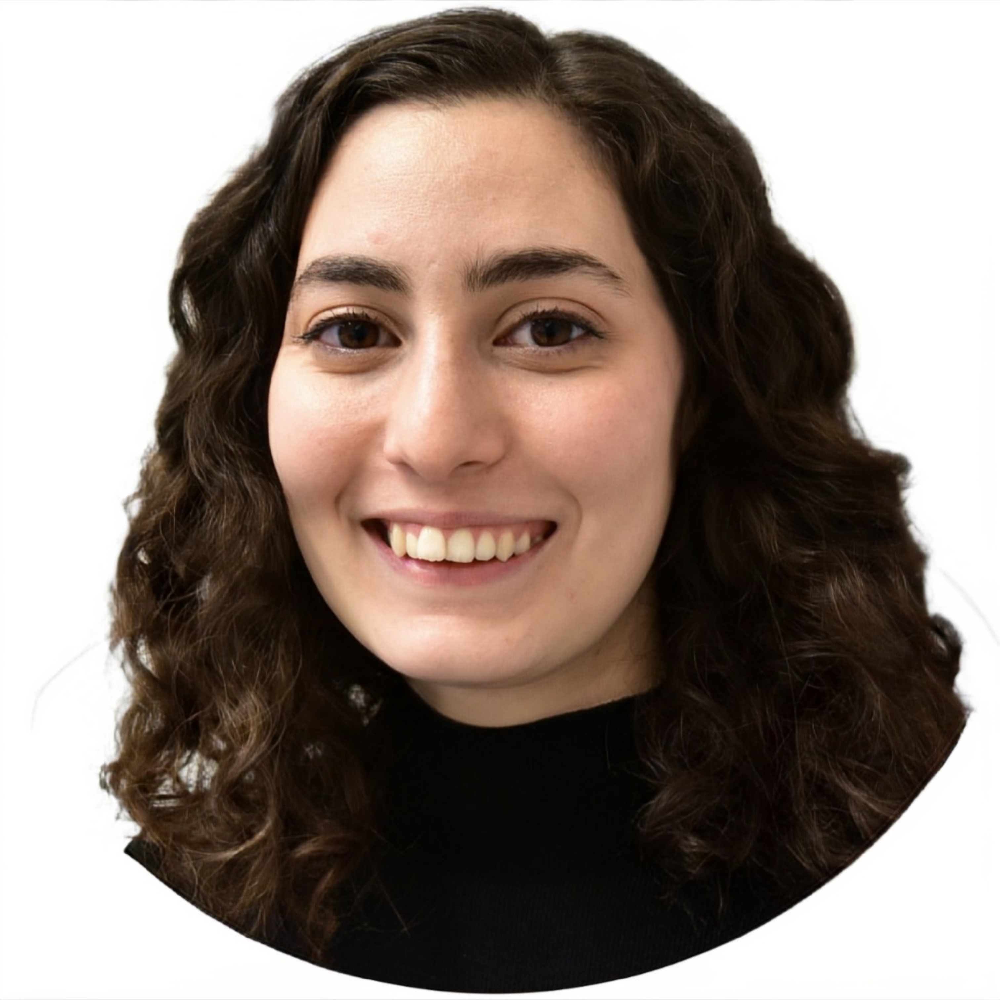

 

Dilara joined the Elgeti Lab in the Winter semester of 2023. She completed her bachelor's and master's degrees in Biology at the Middle East Technical University in Turkey. She worked on adhesion GPCRs during her master's study and subsequently gained experience in structural biology during her internship at the Rudolf Schönheimer Institute for Biochemistry at the University of Leipzig under the supervision of Dr. Sandra Berndt.

Dilara's research is focused on understanding the dynamics of subtype selectivity on peptide receptors of GPCRs.