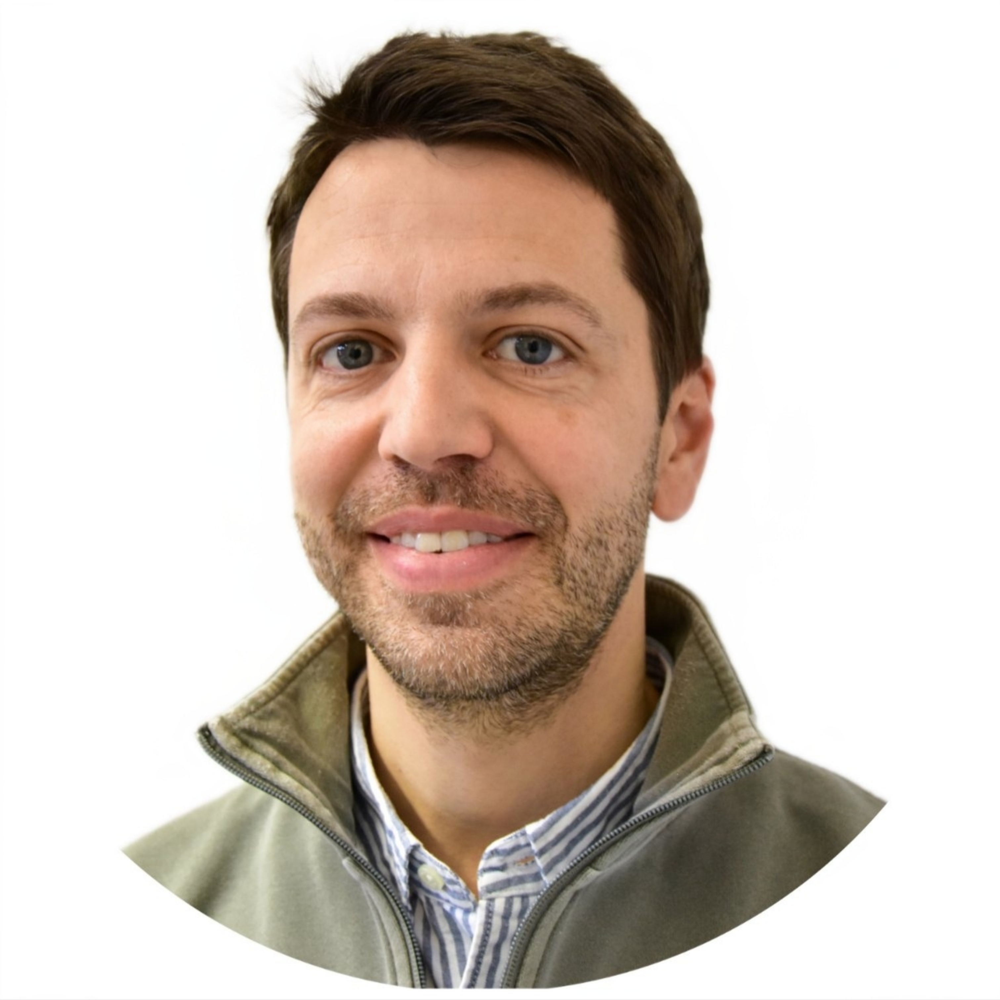

 

Matthias received his PhD in Biophysics from the Humboldt Universitaet zu Berlin, where he worked under the guidance of Drs. Klaus Peter Hofmann and Franz Bartl on time-resolved investigation of photoreactions of visual rhodopsin. He then received postdoctoral training in the laboratory of Dr. Wayne Hubbell at UCLA, where he studied other G protein coupled receptors (GPCRs), such as the beta-adrenergic and angiotensin receptors, using electron paramagnetic resonance (EPR) spectroscopy. In 2020, Matthias started his own independent research program at UCLA, which was focused on comparing different receptors to identify GPCR-conserved and receptor-specific mechanisms. 

In 2023, Matthias joined the Leipzig University Medical School. The Elgeti Lab is part of the newly-formed [Institute for Drug Discovery](https://www.uniklinikum-leipzig.de/einrichtungen/wirkstoffentwicklung) and is located within the Institute for Medical Physics and Biophysics.
